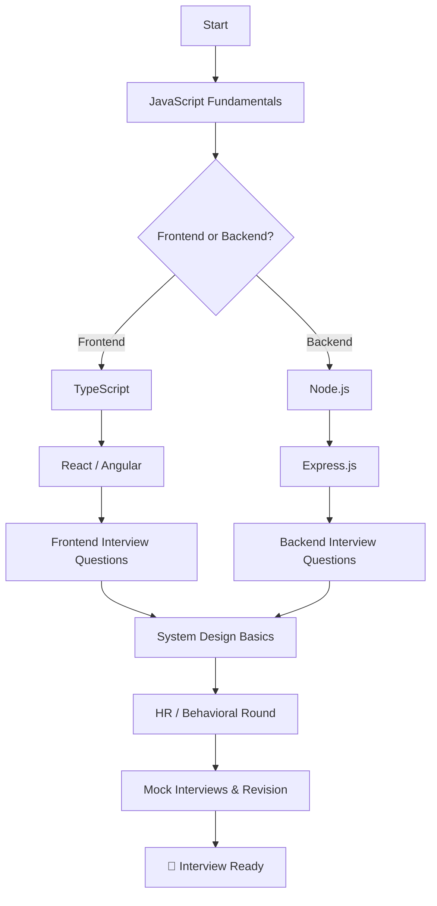

<div align="center">

# 🚀 Web Dev Notes

### Practical, beginner-friendly, interview-focused notes for Frontend & Backend Web Development

[](./javascript)
[](./typescript)
[](./react)
[](./angular)
[](./nodejs)
[](./expressjs)

[](#-contributing)
[](#-license)
[](#)
[](https://www.markdownguide.org/)

</div>

---

## 📖 Introduction

**Web Dev Notes** is a curated, open-source knowledge base designed to help developers **prepare for frontend and backend web development interviews** in a practical and beginner-friendly way.

Every topic follows the **same consistent 10-section interview template**, so you always know exactly where to find the definition, the simple explanation, the syntax, real code examples, interview questions, common mistakes, and advanced notes.

> 💡 **Who is this for?**
> Students, self-taught developers, bootcamp grads, and working professionals who want crisp, structured, interview-ready notes — without sifting through endless tutorials.

---

## 🧰 Tech Stack

| Technology | Area | Folder | Topics |
| :--- | :--- | :--- | :---: |
|  | Frontend / Core | [`/javascript`](./javascript) | 23 |
|  | Frontend / Core | [`/typescript`](./typescript) | 13 |
|  | Frontend | [`/react`](./react) | 18 |
|  | Frontend | [`/angular`](./angular) | 17 |
|  | Backend | [`/nodejs`](./nodejs) | 13 |
|  | Backend | [`/expressjs`](./expressjs) | 12 |

---

## 📂 Folder Structure

```text
web-dev-notes/
│
├── README.md                     # You are here
├── javascript/                   # Core JS interview topics
├── typescript/                   # TypeScript interview topics
├── react/                        # React interview topics
├── angular/                      # Angular interview topics
├── nodejs/                       # Node.js interview topics
├── expressjs/                    # Express.js interview topics
├── assets/                       # Images, diagrams & shared resources
└── interview-preparation/        # Cross-cutting interview material
    ├── 1.frontend-interview-questions.md
    ├── 2.backend-interview-questions.md
    ├── 4.hr-interview-questions.md
    └── 3.system-design-basics.md
```

---

## 🧩 Note Template

Every topic file follows the exact same structure for consistency and fast revision:

```text
# Topic Name              ← with a difficulty label (Beginner / Intermediate / Advanced)

1. Basic Definition       ← technical, interview-style definition
2. Simple Explanation     ← plain words, beginner-friendly
3. Why It Is Used         ← purpose & real-world motivation
4. Key Points             ← must-know facts & gotchas
5. Syntax                 ← syntax reference
6. Example                ← short, runnable code
7. Real World Use Case    ← how it shows up in real projects
8. Interview Questions    ← 5 Q&A
9. Common Mistakes        ← beginner pitfalls
10. Advanced Notes        ← deeper concepts for senior roles
```

### 🎯 Difficulty Labels

| Label | Meaning |
| :--- | :--- |
| 🟢 **Beginner** | Fundamental concepts everyone must know |
| 🟡 **Intermediate** | Frequently asked, requires solid understanding |
| 🔴 **Advanced** | Senior-level / deep-dive concepts |

---

## 🚦 How to Use These Notes

1. **Pick a technology** based on the role you're targeting (e.g. React for frontend, Node.js for backend).
2. **Go folder by folder** — each topic file is prefixed with a number (`1.variables.md`, `2.data-types.md`, …) showing the recommended learning order.
3. **Use the template sections strategically:**
   - Short on time? Read sections **1, 2, 4, and 8**.
   - Deep prep? Read the whole file and run the **Example** code yourself.
4. **Revise with section 8 (Interview Questions)** the night before interviews.
5. **Track your progress** using the checklist below.
6. **Practice the system design & HR material** in [`/interview-preparation`](./interview-preparation).

---

## 🗺️ Interview Preparation Roadmap



**Suggested 6-week plan:**

| Week | Focus |
| :---: | :--- |
| 1 | JavaScript (Variables → Closures → Event Loop) |
| 2 | JavaScript advanced (this, Prototype, Currying, HOF) + TypeScript |
| 3 | React **or** Angular core (Components, State, Hooks/DI) |
| 4 | React/Angular advanced (Performance, Routing, RxJS/Redux) |
| 5 | Node.js + Express.js (REST, Auth, Middleware, Security) |
| 6 | System Design basics + HR prep + mock interviews |

---

## ✅ Progress Tracking Checklist

> Fork the repo and tick boxes as you complete each section. Track your journey!

### JavaScript
- [ ] Variables
- [ ] Data Types
- [ ] Hoisting
- [ ] Scope
- [ ] Closures
- [ ] Callback
- [ ] Promise
- [ ] Async/Await
- [ ] Event Loop
- [ ] Array Methods
- [ ] Objects
- [ ] this Keyword
- [ ] Prototype
- [ ] DOM
- [ ] Debouncing
- [ ] Throttling
- [ ] Memory Leak
- [ ] Execution Context
- [ ] Call, Apply, Bind
- [ ] Currying
- [ ] Higher Order Functions
- [ ] Map, Filter, Reduce
- [ ] Shallow vs Deep Copy

### TypeScript
- [ ] Types
- [ ] Interface
- [ ] Type Alias
- [ ] Generics
- [ ] Enum
- [ ] Tuple
- [ ] Union
- [ ] Intersection
- [ ] Utility Types
- [ ] Type Inference
- [ ] Type Assertion
- [ ] Decorators
- [ ] Advanced Types

### React
- [ ] JSX
- [ ] Components
- [ ] Props
- [ ] State
- [ ] Hooks
- [ ] useEffect
- [ ] useMemo
- [ ] useCallback
- [ ] Context API
- [ ] Redux Basics
- [ ] Lifecycle
- [ ] Virtual DOM
- [ ] Reconciliation
- [ ] Routing
- [ ] Performance Optimization
- [ ] Lazy Loading
- [ ] Error Boundary
- [ ] Controlled Components

### Angular
- [ ] Components
- [ ] Modules
- [ ] Services
- [ ] Dependency Injection
- [ ] RxJS
- [ ] Observables
- [ ] Signals
- [ ] Routing
- [ ] Lifecycle Hooks
- [ ] Pipes
- [ ] Directives
- [ ] Forms
- [ ] Reactive Forms
- [ ] HTTP Client
- [ ] Guards
- [ ] Interceptors
- [ ] Change Detection

### Node.js
- [ ] Event Loop
- [ ] Streams
- [ ] Buffers
- [ ] File System
- [ ] Modules
- [ ] NPM
- [ ] Authentication
- [ ] JWT
- [ ] Middleware
- [ ] REST API
- [ ] Cluster
- [ ] Child Process
- [ ] Security Best Practices

### Express.js
- [ ] Routing
- [ ] Middleware
- [ ] Error Handling
- [ ] Authentication
- [ ] Validation
- [ ] MVC Structure
- [ ] File Upload
- [ ] Rate Limiting
- [ ] CORS
- [ ] Cookies
- [ ] Sessions
- [ ] API Security

### Interview Preparation
- [ ] Frontend Interview Questions
- [ ] Backend Interview Questions
- [ ] HR Interview Questions
- [ ] System Design Basics

---

## 🤝 Contributing

Contributions are warmly welcomed! This is a community learning resource. 🙌

1. **Fork** this repository.
2. **Create a branch:** `git checkout -b add/topic-name`.
3. **Follow the note template** (the 10 sections above) for any new topic.
4. Keep examples **short, correct, and beginner-friendly**.
5. Use proper **markdown formatting**, code blocks, and tables.
6. **Commit:** `git commit -m "docs: add notes on <topic>"`.
7. **Push** and open a **Pull Request** describing your changes.

**Contribution checklist:**
- [ ] File follows the 10-section template
- [ ] Difficulty label added
- [ ] Code examples tested
- [ ] No spelling/grammar errors
- [ ] Linked in the relevant section index (if applicable)

---

## 📜 License

This project is licensed under the **MIT License** — free to use, share, and learn from.

---

<div align="center">

### ⭐ If these notes help you, consider starring the repo!

**Happy Learning & Good Luck with Your Interviews! 🚀**

</div>
