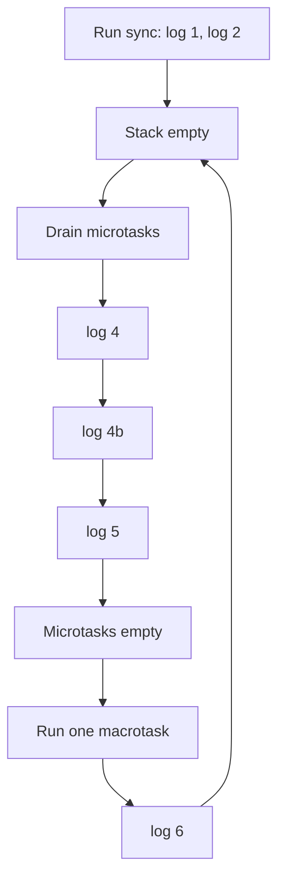
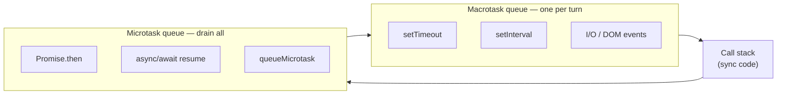

# Microtask & Macrotask Queue

> **Difficulty:** 🟡 Intermediate

## 1. Basic Definition

JavaScript’s runtime uses **two callback queues** for async work:

- **Macrotask queue** (task queue): holds callbacks from timers, I/O, DOM events, and similar “later” work.
- **Microtask queue** (job queue): holds callbacks from Promises, `queueMicrotask`, and (in browsers) `MutationObserver`.

After the **call stack** finishes the current synchronous code, the **event loop** drains **all** microtasks, then runs **one** macrotask, then drains microtasks again — repeating forever.

## 2. Simple Explanation

Think of a single chef (the **call stack**) in a kitchen.

| Queue | Real-life analogy | What goes here |
| :--- | :--- | :--- |
| **Macrotask** | Orders on the **main ticket rail** — bigger jobs scheduled for later | `setTimeout`, `setInterval`, clicks, network callbacks |
| **Microtask** | **Sticky notes** on the counter — “do this immediately before the next main order” | `Promise.then`, `async/await` continuations, `queueMicrotask` |

**Rule the chef follows:**

1. Finish the dish you’re cooking now (sync code on the stack).
2. Read **every** sticky note (microtasks) until none are left.
3. Take **one** ticket from the main rail (one macrotask).
4. Go back to step 2.

So microtasks always jump the line ahead of the next macrotask — that’s why `Promise.then` runs before `setTimeout(fn, 0)`.

## 3. Why It Is Used

Browsers and Node need a **fair, predictable order** for async callbacks without multiple threads in your JS code. Splitting work into microtasks vs macrotasks lets the engine:

- Resolve Promises quickly (microtasks) so chained `.then` handlers feel instant.
- Schedule timers and I/O without blocking the main thread (macrotasks).
- Paint the screen between macrotasks (in browsers), so the UI stays responsive.

## 4. Key Points

| | **Microtask queue** | **Macrotask queue** |
| :--- | :--- | :--- |
| **Also called** | Job queue | Task queue |
| **Runs** | After current stack clears; **all** pending microtasks in a row | One per event-loop turn (after microtasks drain) |
| **Priority** | Higher — runs before next macrotask | Lower |
| **Common sources** | `Promise.then/catch/finally`, `async/await`, `queueMicrotask` | `setTimeout`, `setInterval`, `setImmediate` (Node), I/O, UI events |
| **Starvation risk** | Endless microtasks can delay timers and rendering | Usually one at a time per loop tick |

**One-line rule:** *Sync → all microtasks → one macrotask → repeat.*

## 5. Syntax

```js
// Macrotask
setTimeout(() => console.log("macrotask"), 0);

// Microtask
Promise.resolve().then(() => console.log("microtask"));
queueMicrotask(() => console.log("also microtask"));

// Sync runs first, then microtasks, then macrotasks
console.log("sync");
```

## 6. Example

```js
console.log("1 — sync");

setTimeout(() => console.log("6 — macrotask (timer)"), 0);

Promise.resolve()
  .then(() => console.log("4 — microtask"))
  .then(() => console.log("5 — microtask (chained)"));

queueMicrotask(() => console.log("4b — microtask (queueMicrotask)"));

console.log("2 — sync");

// Output order:
// 1 — sync
// 2 — sync
// 4 — microtask
// 4b — microtask (queueMicrotask)
// 5 — microtask (chained)
// 6 — macrotask (timer)
```

**Why?** Steps 1–2 run on the stack. Timers register a macrotask. Promises and `queueMicrotask` register microtasks. Stack empties → all microtasks (4, 4b, 5) → then one macrotask (6).

### Step-by-step loop (this example)



## 7. Real World Use Case

- **Why `await` feels instant after a fetch:** the Promise microtask runs before the next click handler or `setTimeout`.
- **Why `setTimeout(fn, 0)` doesn’t run “next line”:** it’s a macrotask; all microtasks from your Promise chain run first.
- **UI jank:** firing thousands of `Promise.then` in a loop without yielding can starve macrotasks (including paint).
- **Libraries:** `queueMicrotask` batches DOM reads/writes so layout happens after microtasks, before the next frame.

## 8. Interview Questions

**Q1:** What is the difference between the microtask queue and the macrotask queue?

**A:** Microtasks (Promises, `queueMicrotask`) run immediately after the current call stack clears, and the engine runs **all** of them before taking the next macrotask. Macrotasks (`setTimeout`, I/O, events) run one at a time per loop iteration, after microtasks.

**Q2:** In what order will this log?

```js
console.log("A");
setTimeout(() => console.log("B"), 0);
Promise.resolve().then(() => console.log("C"));
console.log("D");
```

**A:** `A`, `D`, `C`, `B` — sync first, then microtask, then macrotask.

**Q3:** Can microtasks block `setTimeout`?

**A:** Yes. If you keep adding microtasks (e.g. `Promise.resolve().then(() => addAnotherMicrotask())` in a loop), macrotasks and rendering can be delayed — “microtask starvation” of macrotasks.

**Q4:** Is `async/await` a microtask or macrotask?

**A:** The code after `await` runs as a **microtask** (Promise continuation), so it runs before the next macrotask.

**Q5:** Where does `queueMicrotask` put a callback?

**A:** In the **microtask queue**, same priority as `Promise.then`.

## 9. Common Mistakes

- Thinking `setTimeout(fn, 0)` runs before `Promise.then` — it’s the opposite.
- Confusing **call stack** with **queues** — queues hold callbacks waiting; only the stack runs code now.
- Creating infinite microtask chains and wondering why the UI or timers freeze.
- Forgetting that **each macrotask turn** starts with a full microtask drain.

## 10. Advanced Notes

- **Node.js:** `process.nextTick` runs even before other microtasks (technically a separate queue). `setImmediate` is a macrotask in the check phase.
- **Browsers:** Rendering often happens between macrotasks; heavy microtask work can delay paint.
- **Related topic:** [Event Loop](./9.event-loop.md) — the manager that moves work between stack and these queues.

### ASCII: two queues, one loop

```
  ┌──────────────────────────────────────────────────────────┐
  │                     CALL STACK                           │
  │              (runs one function at a time)               │
  └───────────────────────────┬──────────────────────────────┘
                              │ stack empty?
                              ▼
  ┌──────────────────────────────────────────────────────────┐
  │                      EVENT LOOP                          │
  │                                                          │
  │   Step 1 ──▶  Drain MICROTASK queue (all of them)        │
  │               ┌─────────────────────────────┐            │
  │               │ Promise.then / await        │            │
  │               │ queueMicrotask              │            │
  │               │ MutationObserver (browser)  │            │
  │               └─────────────────────────────┘            │
  │                          │                               │
  │   Step 2 ──▶  Run ONE MACROTASK                        │
  │               ┌─────────────────────────────┐            │
  │               │ setTimeout / setInterval    │            │
  │               │ I/O callbacks, click events │            │
  │               └─────────────────────────────┘            │
  │                          │                               │
  │               └────────── repeat ──────────────────────┘ │
  └──────────────────────────────────────────────────────────┘
```

### Mermaid: macrotask vs microtask (side by side)



### Priority cheat sheet

```
  Priority (highest → lowest)

  1. Synchronous code on the call stack
  2. All microtasks (Promises, queueMicrotask, …)
  3. One macrotask (setTimeout, I/O, …)
  4. (repeat from step 2)
```
